<!-- TOC -->

- [Workshop: Build a TTN LoRaWAN Node](#workshop-build-a-ttn-lorawan-node)
    - [Hardware](#hardware)
    - [Adding the antenna and/or headers](#adding-the-antenna-andor-headers)
    - [Connecting DIO1 to D6](#connecting-dio1-to-d6)
- [Software: Getting started](#software-getting-started)
    - [Adding the LORA32U4](#adding-the-lora32u4)
    - [Selecting the correct board](#selecting-the-correct-board)
    - [Get the LMIC library](#get-the-lmic-library)
    - [Get the low power library](#get-the-low-power-library)
- [Create a TTN account](#create-a-ttn-account)
- [The Console](#the-console)
    - [Creating an application](#creating-an-application)
    - [Adding a node](#adding-a-node)
- [Creating the Arduino sketch](#creating-the-arduino-sketch)
    - [Check the console for output](#check-the-console-for-output)

<!-- /TOC -->

# Workshop: Build a TTN LoRaWAN Node

In this workshop we will use a prebuild LoRaWAN node to be used with The Things Network based on an Arduino Pro Micro and RFM95 module. The node software used is LMIC.

## Hardware

The hardware used for this workshop is the LORA32U4 module.

## Adding the antenna and/or headers

Upon delivery the module has no antenna connected. There are two options, connect an antenna using the u.FL connector on the bottom of the module or solder a wire antenna to the hole marked "ANT'. An wire is included, a u.FL to SMA pigtail and SMA antenna are optional components.

For breadboard use two rows of headers can added to the module.

## Connecting DIO1 to D6

For the LoRaWAN stack to work two pins on the need to be wired together. Pin DIO1 (at the end of the large connector) needs to be connected to D6 (on the smaller connector).

# Software: Getting started

Start by downloading and installing the [Arduino IDE](https://www.arduino.cc/en/Main/Software). Once installed, start the IDE.

## Adding the LORA32U4

The LORA32U4 board has not been developed by Arduino. As a result the boards are not available in a newly installed IDE. To add the boards to the IDE open 'Preferences' from the 'File' menu.
In the 'Additional Boards Manager URL' enter 'https://adafruit.github.io/arduino-board-index/package_adafruit_index.json', Close the dialog with 'OK'.

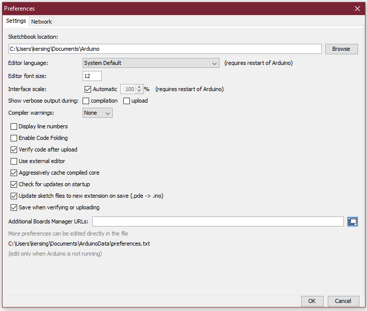

Now go to the 'Tools' menu, item 'Board: "Arduino/Genuino Uno"', this will open a sub menu, select 'Board Manager' from this new menu.

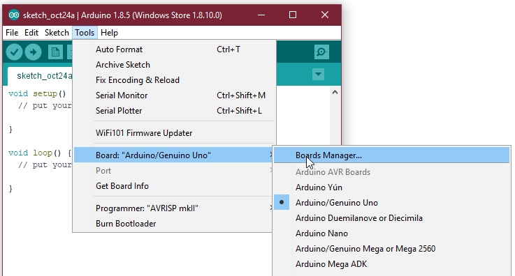

In the boards manager, type 'Adafruit' in the dialog to show all SparkFun provided board packages. Click on 'Adafruit AVR Boards' to select the package and click 'Install' to install the board definitions on your system.


## Selecting the correct board

Open the 'Tools' menu and go to the 'Board: "Arduino/Genuino Uno"' again. Now select 'Adafruit Feather 32u4' from the list.


## Get the LMIC library

The RFM95 is a 'plain' LoRa module. To make the module talk to The Things Network we need to implement the LoRaWAN layer in our code. Luckily we do not need to write the LoRaWAN stack from scratch, there are a number of implementations available on the Internet, LMIC being one of them.
If you search GitHub (or Google) for LMIC you will find numerous versions of the code. The one we will be using is maintained by Matthijs Kooijman.

1. Goto [https://github.com/matthijskooijman/arduino-lmic](https://github.com/matthijskooijman/arduino-lmic)
1. Choose 'Clone or download'
1. Download ZIP (remember the location you save the file)

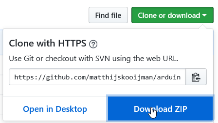

4. In the Arduino IDE select 'Sketch', 'Include Library' and select 'Add .ZIP library' in the sub menu.
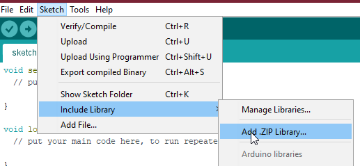

1. Browse to the file you just downloaded and open it
1. The green status bar at the bottom of the Arduino IDE should show a message indicating success.


## Get the low power library

1. Goto [https://github.com/rocketscream/Low-Power](https://github.com/rocketscream/Low-Power)
1. Choose 'Clone or download'
1. Download ZIP (again, remember the location you save the file)
1. In the Arduino IDE select 'Sketch', 'Include Library' and select 'Add .ZIP library' in the sub menu.
1. Browse to the file you just downloaded and open it

# Create a TTN account

If you do not yet have a TTN account (not a forum account) this is the time to create one. Surf to [https://account.thethingsnetwork.org/users/login](https://account.thethingsnetwork.org/users/login) and click on Create an account

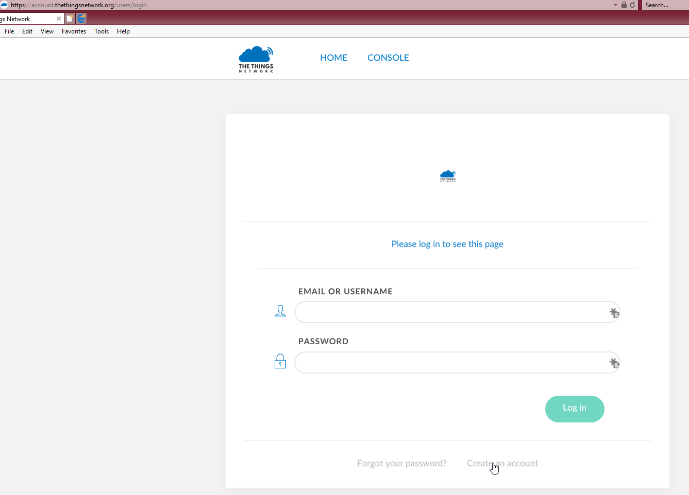

Enter valid information in the form, **read** the "Term and Conditions" and "Privacy Policy" and if you agree with the policies, "Create account".

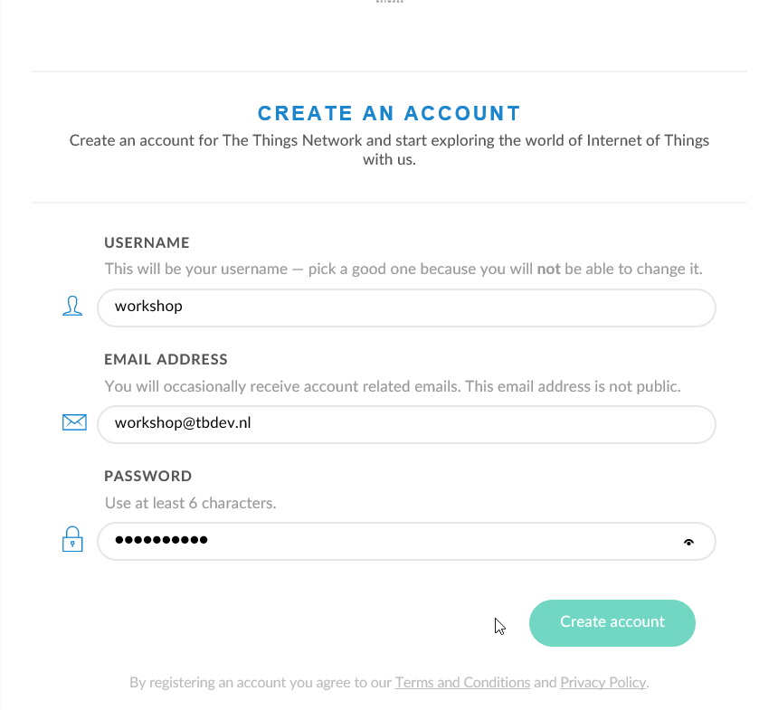

On the next page you will see a message regarding email validation. You will be able to use the account during the workshop, however it will expire at the time and date mentioned if not confirmed before that moment.

# The Console

The Things Network Console is where you register you nodes and (if you happen to own any) your gateways. Once you logged into the account server the console can be reached with a link at the top of the page.


On the console main page choose "Applications" because for TTN nodes are assigned to applications.

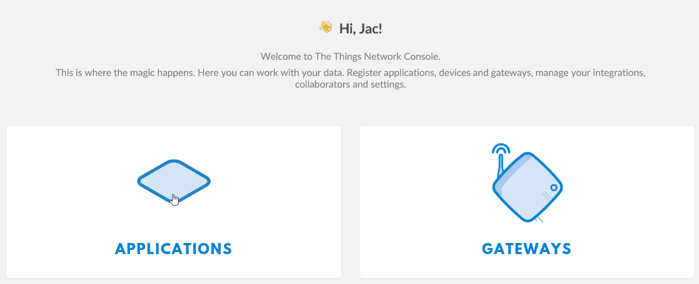

## Creating an application

Because nodes are part of an application the first thing to do is to create an application. On the application page click on "add application".

On the "add application" screen you will need to enter a number of values:

- Application ID : this needs to be a globally unique application identifier which can be seen by other users of the network. Do not use 'sensitive' information as it is not a secret!
- Description : any description that allows you to recognize the application.
- Application EUI : leave empty, the value will be generated.
- Handler registration : use 'ttn-handler-eu'.

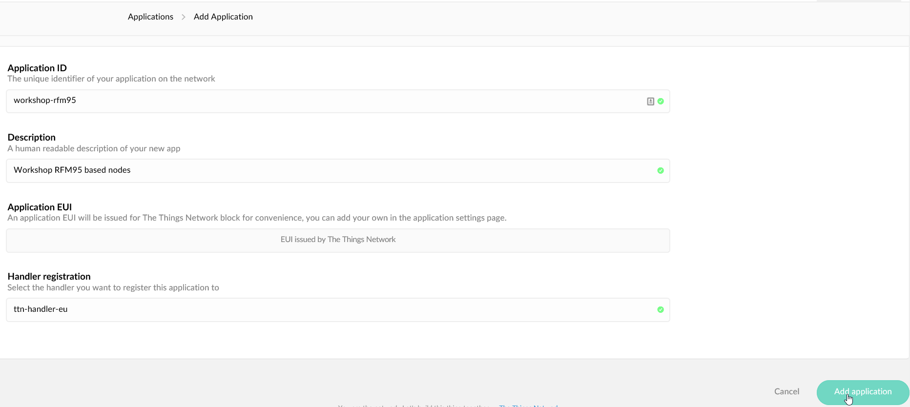

Click on the "Add Application" button to create the application.

If you enter an application ID that is already in use an error will appear when you try to add it.

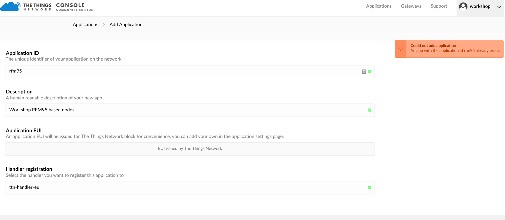

In that case choose a different ID and try again.

## Adding a node

Now we have the application we can register our node. On the application page scroll down to "DEVICES" and click on "register device" on the right hand side.

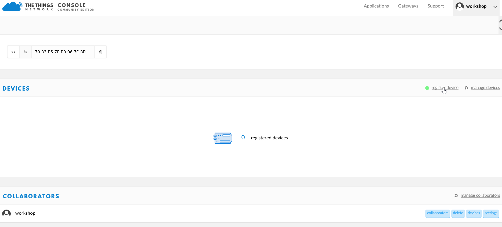

On the newly opened form enter the required information:

- Device ID : unique identifier to allow you to easily recognize the device.
- Device EUI : click on the interlinked arrows at the start of the field to change it to a pencil, now a unique EUI will be generated for us.
- App Key : leave blank, this will be generated as well.

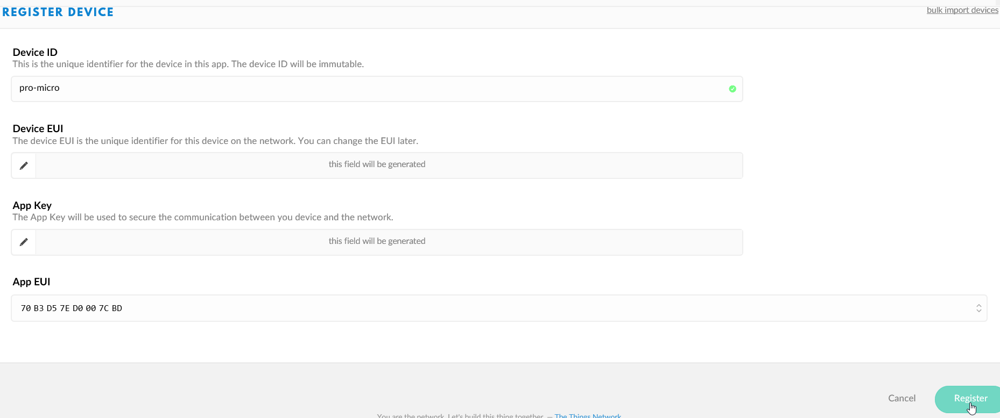

Keep this page open, we will need some of the information during the next steps.

# Creating the Arduino sketch

Everything is now in place to start coding our first Arduino sketch to connect our hardware to TTN.

Download the sample sketch from [https://raw.githubusercontent.com/kersing/node-workshop/master/pro-micro-sketch.ino](https://raw.githubusercontent.com/kersing/node-workshop/master/pro-micro-sketch.ino) or cut-and-paste the code below:
```
/*******************************************************************************
 * Copyright (c) 2015 Thomas Telkamp and Matthijs Kooijman
 *
 * Permission is hereby granted, free of charge, to anyone
 * obtaining a copy of this document and accompanying files,
 * to do whatever they want with them without any restriction,
 * including, but not limited to, copying, modification and redistribution.
 * NO WARRANTY OF ANY KIND IS PROVIDED.
 *
 * This example will send Temperature and Humidity
 * using frequency and encryption settings matching those of
 * the The Things Network. Application will 'sleep' 7x8 seconds (56 seconds)
 *
 * This uses OTAA (Over-the-air activation), where where a DevEUI and
 * application key is configured, which are used in an over-the-air
 * activation procedure where a DevAddr and session keys are
 * assigned/generated for use with all further communication.
 *
 * Note: LoRaWAN per sub-band duty-cycle limitation is enforced (1% in
 * g1, 0.1% in g2), but not the TTN fair usage policy (which is probably
 * violated by this sketch when left running for longer)!

 * To use this sketch, first register your application and device with
 * the things network, to set or generate an AppEUI, DevEUI and AppKey.
 * Multiple devices can use the same AppEUI, but each device has its own
 * DevEUI and AppKey.
 *
 * Do not forget to define the radio type correctly in config.h.
 *
 *******************************************************************************/

#include <avr/sleep.h>
#include <avr/wdt.h>
#include <lmic.h>
#include <hal/hal.h>
#include <SPI.h>
#include "LowPower.h"

#include <Arduino.h>

int sleepcycles = 7;  // every sleepcycle will last 8 secs, total sleeptime will be sleepcycles * 8 sec
bool joined = false;
bool sleeping = false;
#define LedPin 22     // pin 13 LED is not used, because it is connected to the SPI port

// This EUI must be in little-endian format, so least-significant-byte
// first. When copying an EUI from ttnctl output, this means to reverse
// the bytes. For TTN issued EUIs the last bytes should be 0xD5, 0xB3,
// 0x70.

static const u1_t DEVEUI[8]  = { 0x00, 0x00, 0x00, 0x00, 0x00, 0x00, 0x00, 0x00 };
static const u1_t APPEUI[8] = { 0x00, 0x00, 0x00, 0x00, 0x00, 0x00, 0x00, 0x00 };

// This key should be in big endian format (or, since it is not really a
// number but a block of memory, endianness does not really apply). In
// practice, a key taken from ttnctl can be copied as-is.
// The key shown here is the semtech default key.
static const u1_t APPKEY[16] = { 0x00, 0x00, 0x00, 0x00, 0x00, 0x00, 0x00, 0x00, 0x00, 0x00, 0x00, 0x00, 0x00, 0x00, 0x00, 0x00 };

static void initfunc (osjob_t*);

// provide APPEUI (8 bytes, LSBF)
void os_getArtEui (u1_t* buf) {
  memcpy(buf, APPEUI, 8);
}

// provide DEVEUI (8 bytes, LSBF)
void os_getDevEui (u1_t* buf) {
  memcpy(buf, DEVEUI, 8);
}

// provide APPKEY key (16 bytes)
void os_getDevKey (u1_t* buf) {
  memcpy(buf, APPKEY, 16);
}

static osjob_t sendjob;
static osjob_t initjob;

// Pin mapping is hardware specific.
// Pin mapping
const lmic_pinmap lmic_pins = {
  .nss = 8,
  .rxtx = LMIC_UNUSED_PIN,
  .rst = 1, // Needed on RFM92/RFM95? (probably not) D0/GPIO16
  .dio = {7, 6, LMIC_UNUSED_PIN}, // Specify pin numbers for DIO0, 1, 2
// connected to D7, D6, -
};


void onEvent (ev_t ev) {
  int i,j;
  switch (ev) {
    case EV_SCAN_TIMEOUT:
      Serial.println(F("EV_SCAN_TIMEOUT"));
      break;
    case EV_BEACON_FOUND:
      Serial.println(F("EV_BEACON_FOUND"));
      break;
    case EV_BEACON_MISSED:
      Serial.println(F("EV_BEACON_MISSED"));
      break;
    case EV_BEACON_TRACKED:
      Serial.println(F("EV_BEACON_TRACKED"));
      break;
    case EV_JOINING:
      Serial.println(F("EV_JOINING"));
      break;
    case EV_JOINED:
      Serial.println(F("EV_JOINED"));
      // Disable link check validation (automatically enabled
      // during join, but not supported by TTN at this time).
      LMIC_setLinkCheckMode(0);
      digitalWrite(LedPin,LOW);
      // after Joining a job with the values will be sent.
      joined = true;
      break;
    case EV_RFU1:
      Serial.println(F("EV_RFU1"));
      break;
    case EV_JOIN_FAILED:
      Serial.println(F("EV_JOIN_FAILED"));
      break;
    case EV_REJOIN_FAILED:
      Serial.println(F("EV_REJOIN_FAILED"));
      // Re-init
      os_setCallback(&initjob, initfunc);
      break;
    case EV_TXCOMPLETE:
      sleeping = true;
        if (LMIC.dataLen) {
        // data received in rx slot after tx
        // if any data received, a LED will blink
        // this number of times, with a maximum of 10
        Serial.print(F("Data Received: "));
        Serial.println(LMIC.frame[LMIC.dataBeg],HEX);
        i=(LMIC.frame[LMIC.dataBeg]);
        // i (0..255) can be used as data for any other application
        // like controlling a relay, showing a display message etc.
        if (i>10){
          i=10;     // maximum number of BLINKs
        }
          for(j=0;j<i;j++)
          {
            digitalWrite(LedPin,HIGH);
            delay(200);
            digitalWrite(LedPin,LOW);
            delay(400);
          }
      }
      Serial.println(F("EV_TXCOMPLETE (includes waiting for RX windows)"));
      delay(50);  // delay to complete Serial Output before Sleeping

      // Schedule next transmission
      // next transmission will take place after next wake-up cycle in main loop
      break;
    case EV_LOST_TSYNC:
      Serial.println(F("EV_LOST_TSYNC"));
      break;
    case EV_RESET:
      Serial.println(F("EV_RESET"));
      break;
    case EV_RXCOMPLETE:
      // data received in ping slot
      Serial.println(F("EV_RXCOMPLETE"));
      break;
    case EV_LINK_DEAD:
      Serial.println(F("EV_LINK_DEAD"));
      break;
    case EV_LINK_ALIVE:
      Serial.println(F("EV_LINK_ALIVE"));
      break;
    default:
      Serial.println(F("Unknown event"));
      break;
  }
}

void do_send(osjob_t* j) {
  byte buffer[22];
  // It is a bad idea to send ASCII for real, only use this when developing!!
  buffer[0]='H';
  buffer[1]='i';
  if (LMIC.opmode & OP_TXRXPEND) {
    Serial.println(F("OP_TXRXPEND, not sending"));
  } else {
    // Prepare upstream data transmission at the next possible time.
    LMIC_setTxData2(1, (uint8_t*) buffer, 2 , 0);
    Serial.println(F("Sending: "));
  }
}

// initial job
static void initfunc (osjob_t* j) {
    // reset MAC state
    LMIC_reset();
    LMIC_setClockError(MAX_CLOCK_ERROR * 1 / 100);
    // start joining
    LMIC_startJoining();
    // init done - onEvent() callback will be invoked...
}

void setup()
  {

  delay(10000);
  Serial.begin(9600);
  Serial.println(F("Starting"));
  delay(10000);
  os_init();
  // Reset the MAC state. Session and pending data transfers will be discarded.
  os_setCallback(&initjob, initfunc);
  LMIC_reset();
}


void loop()
{
    // start OTAA JOIN
    if (joined==false)
    {

      os_runloop_once();

    }
    else
    {
      do_send(&sendjob);    // Sent sensor values
      while(sleeping == false)
      {
        os_runloop_once();
      }
      sleeping = false;
      for (int i=0;i<sleepcycles;i++)
      {
          LowPower.powerDown(SLEEP_8S, ADC_OFF, BOD_OFF);    //sleep 8 seconds
      }
    }

      digitalWrite(LedPin,((millis()/100) % 2) && (joined==false)); // only blinking when joining and not sleeping

}
```

To 'tune' this example to your TTN application you need to change:

- DEVEUI
- APPEUI
- APPKEY

Go back to the browser and open the console page for the device you created earlier. This page will list the three items listed above. Between the label and the value is are two icons. One with '<>' and one with two arrows. For all three values press the '<>' icon to show the values C-style (with '{' and 0x), for DEVEUI and APPEUI hit the arrow icon once to change to LSB setting.

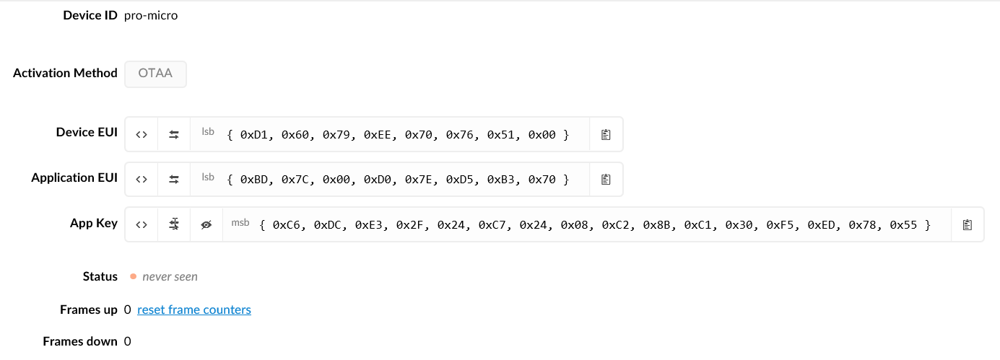

Now copy the three values to your sketch. Use the 'notepad' icon at the end of the value to copy the value to the clipboard.

Save the result and compile the sketch by hitting the check mark icon below 'File'. If no error are shown connect your node to your system using an USB mini cable. A red LED should light indicating the module is powered.

Wait a few seconds for the system to install the appropriate USB drivers. Next go to 'Tool', 'Port' in the Arduino IDE and select the port your LORA32U4 is connected to.

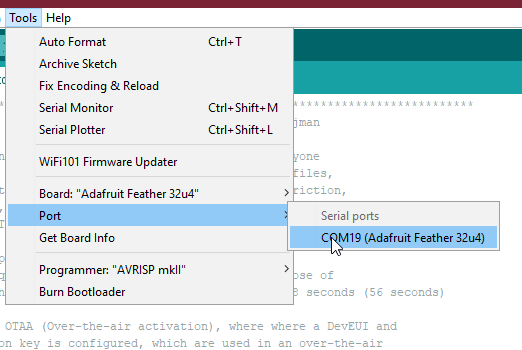

Now send the sketch to the board using the arrow icon below 'Edit'. Once the upload is finished open the 'Serial monitor' from the 'Tools' menu. After a few seconds output should start to appear in the monitor.

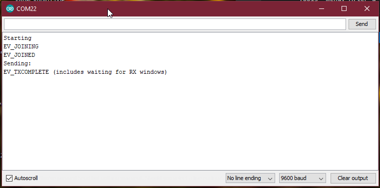

## Check the console for output

In the web browser with the TTN console switch to the 'Data' tab. Data should start to appear on this page once the node is up and running.

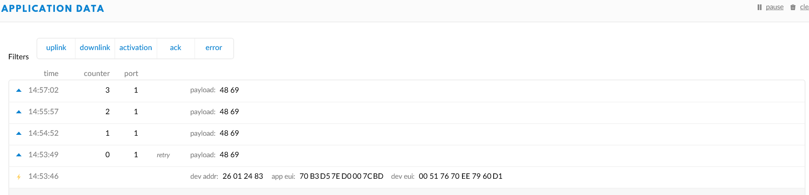

